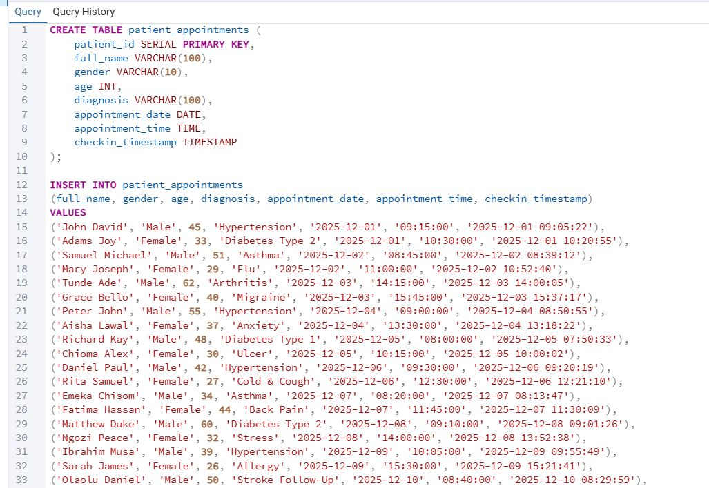
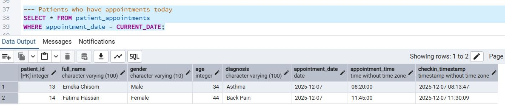

# PATIENTS APPOINTMENTS

## INTRODUCTION

This project is about retreiving date and time of patient appointment for each patient to know when they will have appointments for check up

# OBJECTIVES 

- TO detemine the precise time each patients will be having appointment and the Doctor to have proper planning for the patent
- To examine the use of CAST(), NOW(), CURRENT_DATE(), CURRENT_TIME() function in the query Analysis to get the resuit

## THE ANALYSIS

In the dataset the following question were asked to query the dataset and determine the patient appointments

### Step taken

The table was successful created to load the dataset into the table

- Patients that have appointments today

In the query result it shows that only 2 people have appointment see from the query image attached

- Patients who check in the last 30 minutes

In the query result image attached we can confirm the patients that check in the last 30 minutes

_JPG.JPG)

- In the query I extract only the appointment time

In the query image attached we can detemine the number of people that have appointments and the time of the appointment

_JPG.JPG)

- Finding the appointments that happens before 12 noon
  
In the query image attached we can detemine the number of people that have appointments before 12 noon
_JPG.JPG)

- I combine current time stamp with Calculation
_JPG.JPG)

